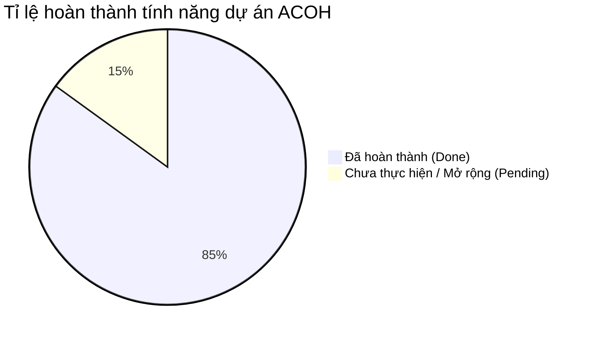

# BÁO CÁO HIỆN TRẠNG DỰ ÁN (PROJECT STATUS REPORT)
**Tên dự án:** AutoCare Office Helper (ACOH)  
**Ngày cập nhật:** 05/08/2026  
**Công nghệ:** NestJS (Backend), ReactJS + Vite + TailwindCSS (Frontend), MS SQL Server (Database), Socket.IO (Real-time), WebSockets.

---

## I. TỔNG QUAN TỈ LỆ HOÀN THÀNH

---

## II. CHI TIẾT TÍNH NĂNG ĐÃ HOÀN THÀNH (COMPLETED MODULES)

### 1. Module Xác thực & Quản lý Tài khoản (Authentication & Users)
* [x] **Đăng ký / Đăng nhập / JWT Auth:** Phân quyền 3 vai trò rõ ràng (`Admin`, `Garage`, `User`).
* [x] **Bảo mật:** Hash mật khẩu với bcrypt, Guard phân quyền API (`AuthGuard`, `RolesGuard`).
* [x] **Cấu hình giao diện cá nhân:** Lưu tùy chọn giao diện Dark Mode / Light Mode cho từng tài khoản (`themePreference`).

### 2. Module Quản lý Phương tiện (Vehicle Management)
* [x] **Quản lý xe cá nhân:** Thêm, sửa, xóa, xem danh sách xe của tài khoản.
* [x] **Thông số chi tiết:** Loại xe (Ô tô/Xe máy), Biển số, Nhãn hiệu, Dòng xe, Năm sản xuất, Ngày mua, Số km hiện tại (`CurrentOdometer`).
* [x] **Hỗ trợ Xe Dịch vụ (Commercial Vehicles):** Bổ sung thuộc tính Xe chạy dịch vụ (`isCommercial`), Mã hợp tác xã (`htxCode`), Số phù hiệu xe (`badgeNumber`).

### 3. Module Quản lý Pháp lý & Giấy tờ Xe (Legal Documents Management)
* [x] **Quản lý đa dạng loại giấy tờ:** Đăng kiểm, Bảo hiểm vật chất xe (thân vỏ), Bảo hiểm TNDS bắt buộc, Giấy phép lái xe cá nhân.
* [x] **Tự động tính toán trạng thái:** Tự động đối chiếu số ngày còn lại đến hạn (`DATEDIFF`) để gắn nhãn trạng thái: `Còn hạn`, `Sắp hết hạn`, `Quá hạn`.
* [x] **Ngưỡng cảnh báo tùy chỉnh:** Cho phép cài đặt số ngày cảnh báo trước (`AlertThresholdDays`).

### 4. Module Khung Bộ thông số & Lịch bảo dưỡng (Maintenance Matrix & Schedules)
* [x] **Danh mục hạng mục chuẩn:** Xây dựng ma trận bảo dưỡng phân theo mốc km (5.000 km, 10.000 km, 20.000 km, 40.000 km...).
* [x] **Checklist mốc bảo dưỡng:** Cho phép chọn mốc km và tích chọn các hạng mục cần làm (`PresetOdometerChecklist`).
* [x] **Lịch nhắc bảo dưỡng:** Quản lý lịch bảo dưỡng theo ngày (`TargetDate`) hoặc theo số km (`TargetOdometer`).
* [x] **Lịch sử bảo dưỡng:** Lưu vết toàn bộ lịch sử sửa chữa, thay thế linh kiện, chi phí và thông tin Gara thực hiện.

### 5. Module Đặt lịch hẹn Bảo dưỡng (Appointments Management)
* [x] **Đặt lịch hẹn với Gara:** Chủ xe chọn Gara đối tác, chọn ngày giờ, chọn dịch vụ/hạng mục bảo dưỡng và gửi yêu cầu.
* [x] **Quy trình xử lý lịch hẹn tại Gara:** Gara nhận yêu cầu -> Duyệt / Từ chối / Hoàn tất lịch hẹn.
* [x] **Tự động cập nhật lịch sử:** Khi Gara bấm hoàn tất, hệ thống tự động ghi nhận vào lịch sử bảo dưỡng của xe và cập nhật lại Odometer mới.

### 6. Module Thông báo Thời gian thực & Cron Job (Notifications & Scans)
* [x] **In-App Realtime Push (Socket.IO):** Bắn thông báo tức thì lên màn hình (Toast Popup) và nhảy số đếm chuông chưa đọc không cần F5.
* [x] **Email Notification:** Gửi Email nhắc nhở tự động qua SMTP (`MailerService`).
* [x] **Tự động quét hàng ngày (Cron Job `@Cron('0 0 * * *')`):**
  * Quét giấy tờ & bảo hiểm sắp hết hạn.
  * Quét lịch bảo dưỡng sắp đến theo mốc thời gian.
  * Quét lịch bảo dưỡng & thay nhớt sắp đến theo số km (`TargetOdometer - CurrentOdometer <= AlertThresholdKM`).
* [x] **Thông báo từ Gara:** Gara gửi thông báo hoàn tất bảo dưỡng tới chủ xe khi làm xong.

### 7. Module Trợ lý AI & Tiện ích Mở rộng (AI Extensions & Utilities)
* [x] **Trợ lý tư vấn AI Chatbot:** Giải đáp thắc mắc về chu kỳ thay nhớt, quy định đăng kiểm, loại bảo hiểm, chẩn đoán đèn báo lỗi động cơ (Check Engine).
* [x] **Nhận diện Biển số xe AI OCR (License Plate OCR):** Quét ảnh biển số xe từ camera/file để tự động trích xuất chuỗi biển số và tra cứu nhanh hồ sơ xe & lịch sử bảo dưỡng.
* [x] **Đánh giá Gara đối tác:** Khách hàng viết đánh giá, chấm điểm sao (Rating) cho Gara.
* [x] **Xuất báo cáo chi tiêu CSV:** Xuất toàn bộ file CSV thống kê chi phí bảo dưỡng (chuẩn UTF-8 BOM tiếng Việt).
* [x] **Xuất hóa đơn thanh toán CSV:** Xuất hóa đơn chi tiết từng lần bảo dưỡng.

### 8. Module Phân tích & Báo cáo (Analytics & Dashboard Stats)
* [x] **Dashboard Chủ xe:** Thống kê tổng quan số xe, nhắc nhở sắp tới, tổng chi phí đã chi trả.
* [x] **Dashboard Gara:** Báo cáo doanh thu, số lượt bảo dưỡng, lịch hẹn chờ duyệt, danh sách khách hàng.
* [x] **Dashboard Admin:** Quản lý toàn bộ người dùng, danh sách Gara đối tác, tổng quan hệ thống.

### 9. Giao diện & Trải nghiệm Người dùng (UI/UX Design)
* [x] **Mobile First Responsive:** Tối ưu hiển thị mượt mà trên di động với Bottom Navigation Bar.
* [x] **Dark Mode / Light Mode:** Bộ chuyển đổi giao diện nền tối chống mỏi mắt.

---

## III. CHI TIẾT TÍNH NĂNG CHƯA THỰC HIỆN / ĐỀ XUẤT MỞ RỘNG (PENDING FEATURES)

> [!IMPORTANT]
> Các tính năng dưới đây chưa có trong mã nguồn hiện tại và có thể đưa vào lộ trình phát triển giai đoạn tiếp theo.

| STT | Tính năng / Module | Mô tả chi tiết | Trạng thái hiện tại |
| :--- | :--- | :--- | :--- |
| 1 | **Tích hợp Zalo ZNS / SMS Gateway** | Tự động gửi tin nhắn thông báo qua Zalo ZNS hoặc SMS đến điện thoại chủ xe khi đến hạn thay nhớt, đăng kiểm, bảo hiểm. | 🔴 Chưa thực hiện (Mới có In-app & Email) |
| 2 | **AI OCR quét Sổ Đăng Kiểm tự động** | Dùng AI (Google Vision / Tesseract) đọc ảnh Sổ đăng kiểm để tự trích xuất Số quản lý, Ngày hết hạn, Số khung, Số máy và tự điền form. | 🔴 Chưa thực hiện (Mới có OCR quét biển số xe) |
| 3 | **AI OCR quét Hóa đơn / Phiếu thu tiền cũ** | Quét ảnh hóa đơn sửa xe cũ để tự động phân tích các dòng phụ tùng, đơn giá và điền tự động vào lịch sử chi tiêu. | 🔴 Chưa thực hiện |
| 4 | **Tự động sinh bộ Lịch bảo dưỡng mẫu khi tạo Xe** | Vừa thêm xe mới (với km hiện tại và ngày mua) là hệ thống tự động khởi tạo sẵn trọn bộ lịch nhắc thay nhớt 5.000km, 10.000km, đăng kiểm định kỳ. | 🟢 Đã hoàn thành (Tự động khởi tạo theo loại xe & mốc km) |
| 5 | **Tích hợp Cổng thanh toán trực tuyến** | Thanh toán tiền cọc đặt lịch hoặc thanh toán hóa đơn bảo dưỡng trực tiếp qua VNPAY / MoMo / ZaloPay. | 🟢 Đã hoàn thành (Tích hợp VNPAY QR / VietQR / Sandbox 1-Click) |
| 6 | **Kết nối thiết bị phần cứng OBD2 / GPS** | Cắm thiết bị OBD2 hoặc GPS trên xe để tự động cập nhật số km thực tế (Odometer) về app mà không cần nhập tay. | 🔴 Chưa thực hiện |
| 7 | **Ứng dụng Mobile Native (iOS / Android)** | Đóng gói ứng dụng thành App di động Native (React Native / Flutter) tải từ App Store / Google Play Store. | 🔴 Chưa thực hiện (Hiện tại là Web Responsive) |

---

## IV. ĐÁNH GIÁ & ĐỀ XUẤT HƯỚNG TRIỂN KHAI TÍẾP THEO

1. **Về tính năng cốt lõi (Core Business):** Hệ thống đã hoàn thành đầy đủ các luồng nghiệp vụ cơ bản từ Quản lý xe, Giấy tờ, Đăng kiểm, Bảo dưỡng theo km/ngày, Đặt lịch hẹn, Chuông thông báo Realtime, AI Chatbot tư vấn và OCR Biển số xe.
2. **Nếu muốn nâng cấp thêm cho Đồ án / Sản phẩm:**
   - **Ưu tiên #1:** Xây dựng tính năng **AI OCR quét Sổ Đăng Kiểm** (dựa trên khung OCR Scan Plate đã có sẵn).
   - **Ưu tiên #2:** Thêm logic **Auto-generate bộ lịch bảo dưỡng mẫu** ngay sau khi thêm xe mới.
   - **Ưu tiên #3:** Tích hợp SDK gửi tin nhắn **Zalo ZNS**.
